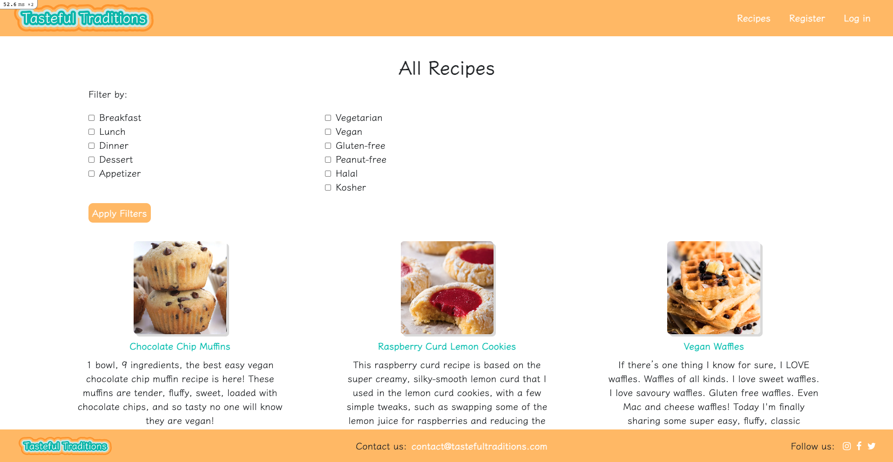
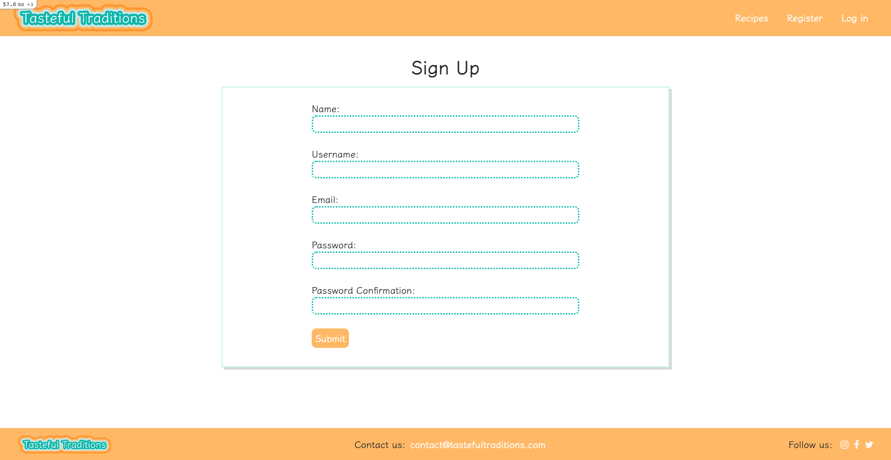
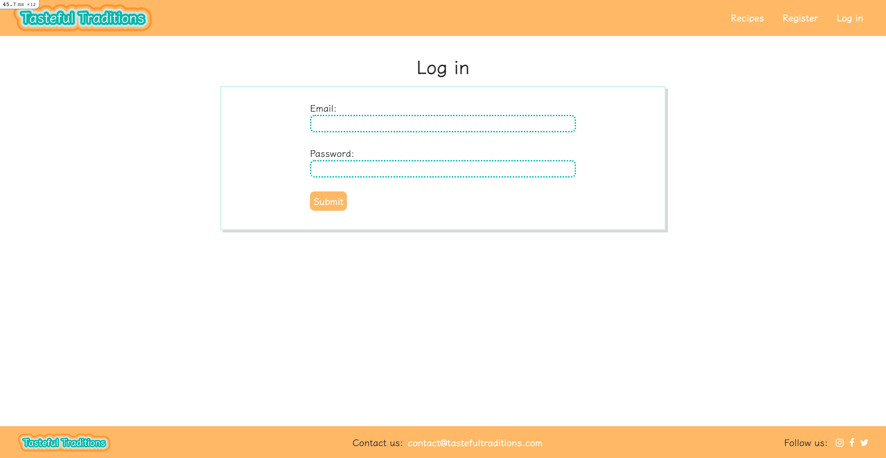
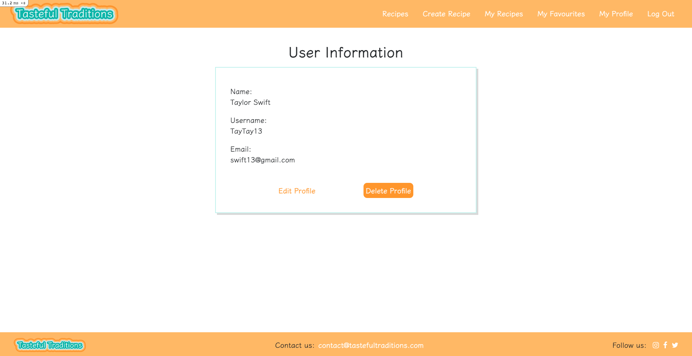
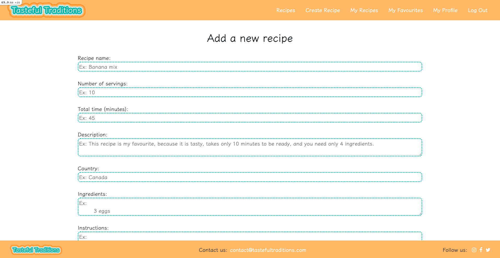
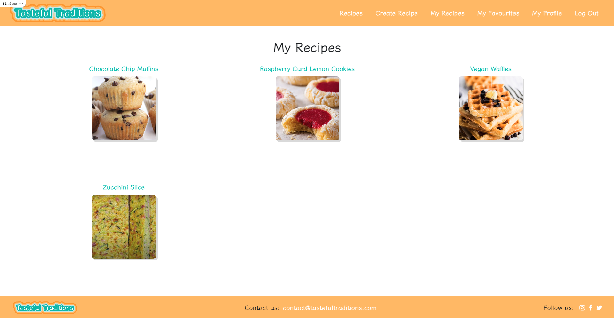
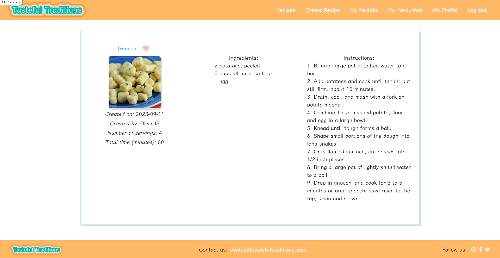
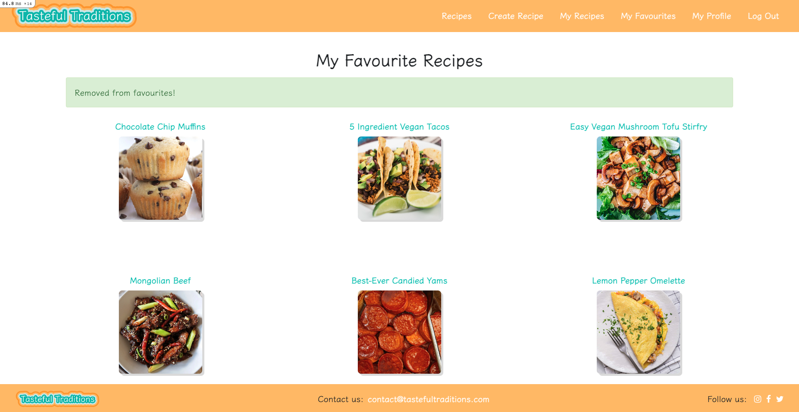
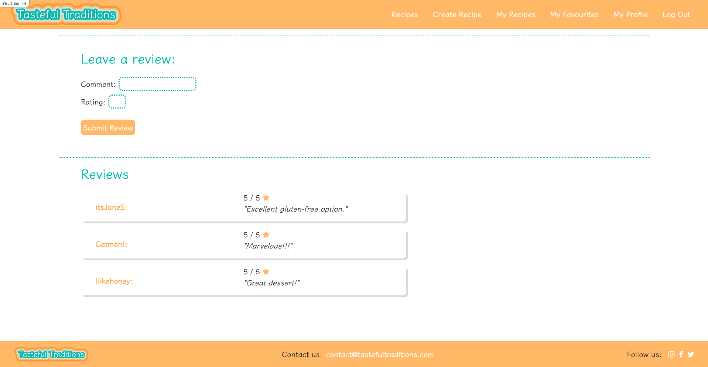

# README

# Tasteful Traditions 

A recipe sharing app, built using Ruby on Rails 6.0.0, powered by ActiveRecord, designed to help users discover, share, and organize their favourite recipes. Whether you're a seasoned chef or just getting started in the kitchen, this app provides an easy-to-use platform for creating, searching, and sharing delicious recipes with a vibrant community of food enthusiasts.

As a non-registered user, I can see...
* Recipe Page

* Register Page

* Login Page 

As a registered user, I can see...
* User Page

* Create Recipe Page 

* My Recipes Page 

* Individual Recipe Page, where a filled in heart means favourited

* If you unclick the heart, it removes it from favourited 

* Can post and read reviews

This README would normally document whatever steps are necessary to get the
application up and running.

Things you may want to cover:

* Ruby version

* System dependencies

* Configuration

* Database creation

* Database initialization

* How to run the test suite

* Services (job queues, cache servers, search engines, etc.)

* Deployment instructions

* ...

